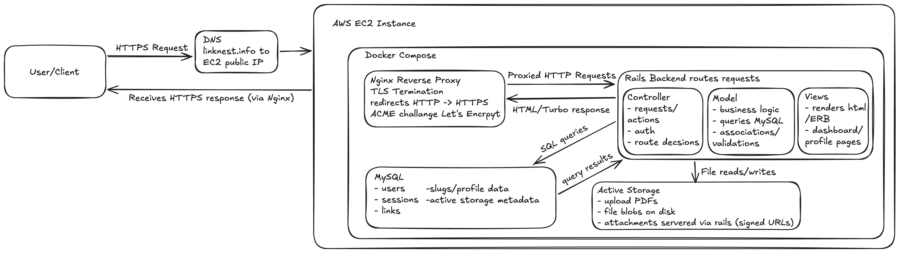

# LinkNest

## Architecture

  

A scalable multi-tenant link-in-bio platform that allows users to create customizable public profile pages and track real-time analytics through optimized, write-heavy event logging.

---

## Tech Stack

- Ruby
- Ruby on Rails
- MySQL
- AWS EC2
- Nginx
- Active Storage
- Docker

---

## Features

### Multi-Tenant Profile Architecture
- Unique slug-based public profiles (`yourapp.com/username`)
- Strict ownership scoping for secure user data isolation
- Designed for scalable profile-based SaaS systems

### Optimized Read-Heavy Profile Delivery
- Indexed slug lookups for fast profile resolution
- ETag / Last-Modified headers for efficient browser caching
- Cache invalidation tied to profile content updates

### Resume File Management
- Upload, preview, and download PDF resumes from profiles
- Managed with Active Storage for safe file handling
- Unified link and file experience in a single profile flow

### Analytics Pipeline Design
- Captures click events separately from reporting reads
- Background jobs aggregate data into hourly/daily metrics
- Enables scalable analytics without impacting request latency

### Production Deployment Architecture
- Dockerized Rails app for consistent environments
- Nginx reverse proxy with HTTPS/TLS configuration
- Ready for internet-facing production deployment

### Authentication and Access Control
- Devise-based authentication for user account management
- Ownership checks prevent cross-user data access
- Clear separation of public and private routes

### Security and Reliability Hardening
- Strong validations and uniqueness constraints
- Safer URL handling and session/auth edge-case fixes
- Dependency auditing and vulnerability patching

---

## 📚 What I Learned From This Project

- **Designing a Multi-Tenant System**
 Structured data models to isolate user data safely while supporting scalable public traffic across thousands of profiles.
   
- **Aggressive MySQL Indexing**
  Implemented compound indexes (profile_id, occurred_at) and unique constraints to maintain performance under scale.

- **Integrated Continuous Integration**
  Implemented GitHub action workflows for continuous integration and continuous delivery
   
- **Background Processing with Sidekiq**
  Built asynchronous aggregation jobs to maintain responsive dashboards while handling high event volume.

---

## Running the Project

### To run the project locally, follow these steps:

  1. Clone the repo (git clone <url>)
  2. Install dependencies (bundle install)
  3. Setup database (rails db:create db:migrate)
  4. Start Redis (redis-server)
  5. Start Rails (rails server)
  6. Start Sidekiq (in another terminal) (bundle exec sidekiq)
     
### Run with Docker

  1. Build image (docker build -t linknest:latest .)
  2. Run containers (docker compose up --build)
